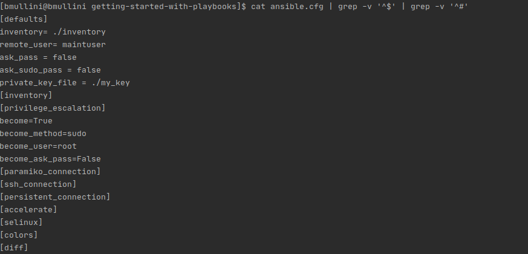

# Working with Ansible

Last updated: 06.19.2020

## Purpose

The purpose of this document is to show how to install
and work with **Ansible Molecule**.

## Prerequisites

Fedora 27 or newer.

### A Running VM

You can create your VM anyway you want.  

One option is to use Terraform to create an Amazon EC2 instance (VM).
I have instructions on setting up your environment in the
[terraform for beginners git repo](https://github.com/bretmullinix/terraform-for-beginners/tree/master/t1-getting-started).
In the repo be sure to follow the instructions in the
[readme.md](https://github.com/bretmullinix/terraform-for-beginners/tree/master/t1-getting-started/readme.md)
and the instructions in the
[ about how to inject your private key into an ec2 instance](https://github.com/bretmullinix/terraform-for-beginners/tree/master/t3-injecting-your-ssh-key-into-ec2-instance).

### Installation

#### Installing Python 3 on Fedora
1. Open up a terminal
1. sudo dnf install python3.8
1. Type `python3.8 --version`
1. The output should show you are running Python 3.8.0

#### Installing Docker on Fedora

1. Open up a terminal
1. sudo dnf install -y grubby
1. sudo grubby --update-kernel=ALL --args="systemd.unified_cgroup_hierarchy=0"
1. sudo reboot
1. sudo dnf config-manager --add-repo=https://download.docker.com/linux/fedora/docker-ce.repo
1. sudo dnf install docker-ce
1. sudo systemctl enable --now docker
1. systemctl enable --now docker
1. The output show that you have **docker** running on your machine.

To enable a regular user to run **docker**, perform the following steps:

1. sudo groupadd docker
1. sudo usermod -aG docker USERNAME

### Instructions

1. Open up a terminal
1. Navigate to a directory where you plan on putting your
python virtual environments.

    :warning: You must always work out of a virtual environment.
    Virtual environments prevent you from corrupting
    your default system virtual environment and allow users to install different
    software for each virtual environment.

1. Run `python3.8 -m venv venv_ansible_molecule`
1. To activate your virtual environment on **Windows**, you run
`./venv_ansible_molecule/Scripts/activate`
1. To activate your virtual environment on **Fedora**, you run
`source ./venv_ansible_molecule/bin/activate`
1. Run `python --version`.  This is the version of Python running in your
virtual environment.
1. Run `pip install --upgrade pip`
1. Run `pip list`.  This should list the modules currently installed in your
environment.  Notice how ansible is not present.
1. Run `pip install ansible==2.9`.  The command installs **ansible 2.9** in the
virtual environment
1. Run `pip list` to confirm **ansible 2.9** is installed.
1. Run 'pip install molecule==3.0.4'
1. Run `pip list` to confirm **molecule 3.0.4** is installed.
1  Run 'pip install molecule[docker]'

    The **molecule[docker]** provides the code to spin up
    docker containers for molecule tests.

1.  Run `cat ansible.cfg | grep -v '^$' | grep -v '^#'`.  You will get
the following output:

    

    The active configuration is explained below:
    
      - **inventory** = Currently, the value specifies the inventory directory to
        find all the inventory files.  If you had more than one
        inventory file, you could add them to this directory and ansible
        would allow you to specify any server or group(s)
        listed in any of the files.
        
      - **remote_user** = The user on the remote machine you
        plan to login as using ssh.
        
      - **ask_user** = If set to true, before you run an ansible command(s),
        the ansible program will prompt you for a password.  Since we are going to
        be using a private key file, we won't need a password prompt on ssh
        login.
        
      - **ask_sudo_pass** = If set to true, before any privileged ansible
        command(s) can be run, the ansible program
        will prompt you for a password. If your user requires a
        password when running a **sudo** command, 
        you will need to set this to true.
        
      - **private_key_file** = The private key file that is used to login using
        ssh.
      
      - **become** = If set to true, the environment is run in privileged mode.
      
      - **become_method** = The method to become the privileged user.  In
      this case we are using the **sudo** method.
      
      - **become_user** = The privileged user to run as.  In this case
      we are using the **root** user.
      
      - **become_ask_pass** = If set to true, when running Ansible, the
      Ansible program will prompt you for the privileged user's password.  In our
      case the login user does not require a password to change to the
      privileged user.

1. Copy your **my_key** private key file for your vm to this directory.

1. Edit the **./inventory/my_first_inventory** file and change the ip to
correspond to the ip of your VM.

1. Create an Ansible role with Molecule by running the following:

`molecule init role my-first-ansible-molecule-role`

:construction: Under Construction...

All artifacts are in the **getting-started** folder.
