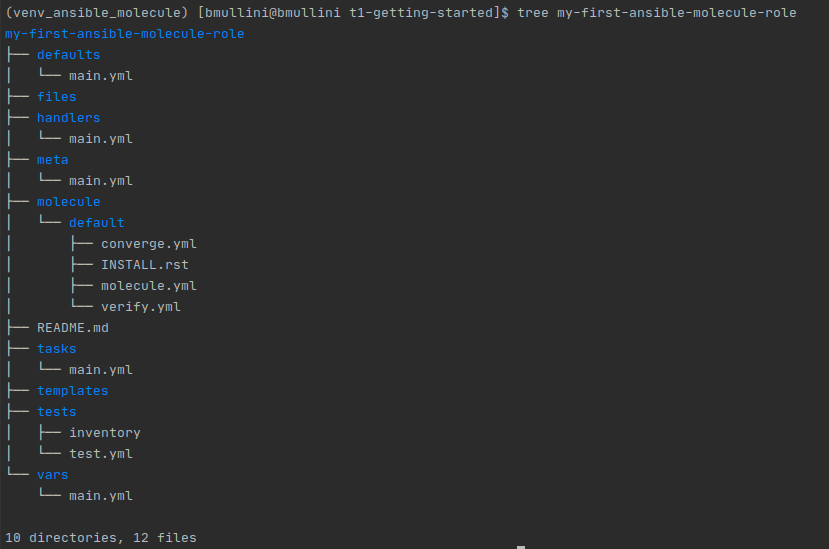
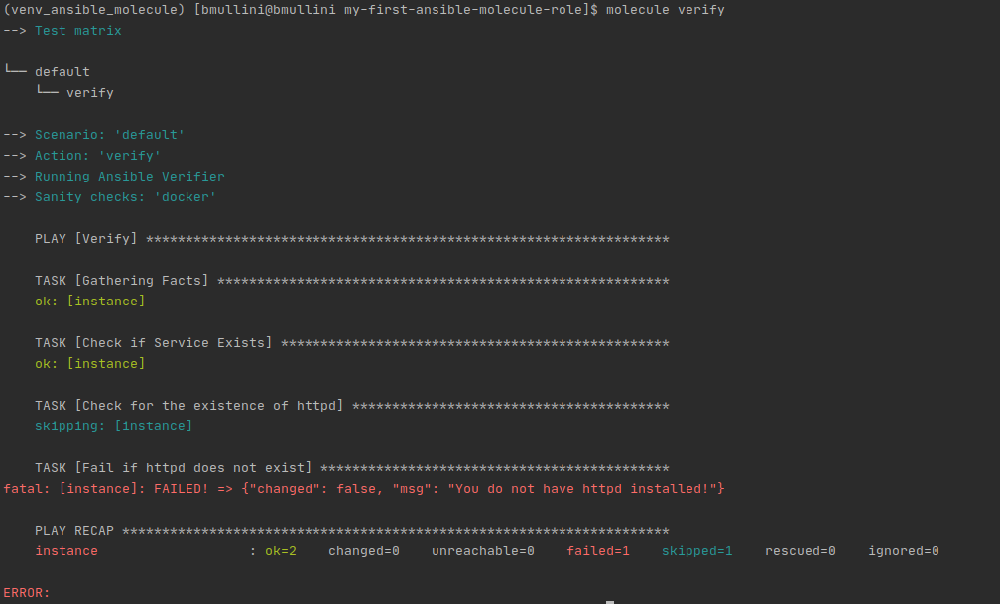
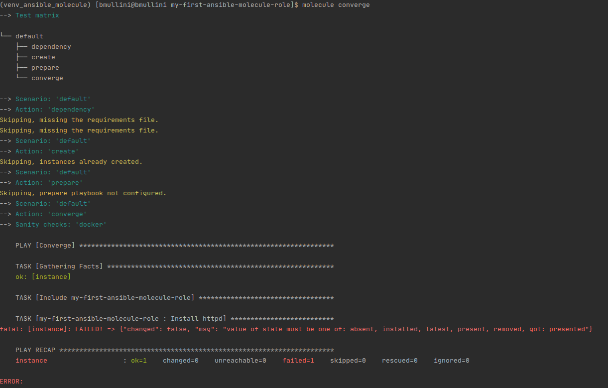

# Working with Ansible

Last updated: 06.19.2020

## Purpose

The purpose of this document is to show how to install
and work with **Ansible Molecule**.

## Prerequisites

Fedora 27 or newer.

### A Running VM

You can create your VM anyway you want.  

One option is to use Terraform to create an Amazon EC2 instance (VM).
I have instructions on setting up your environment in the
[terraform for beginners git repo](https://github.com/bretmullinix/terraform-for-beginners/tree/master/t1-getting-started).
In the repo be sure to follow the instructions in the
[readme.md](https://github.com/bretmullinix/terraform-for-beginners/tree/master/t1-getting-started/readme.md)
and the instructions in the
[ about how to inject your private key into an ec2 instance](https://github.com/bretmullinix/terraform-for-beginners/tree/master/t3-injecting-your-ssh-key-into-ec2-instance).

### Installation

#### Installing Python 3 on Fedora
1. Open up a terminal
1. sudo dnf install python3.8
1. Type `python3.8 --version`
1. The output should show you are running Python 3.8.0


#### Installing Docker on Fedora

1. Open up a terminal
1. sudo dnf install -y grubby
1. sudo grubby --update-kernel=ALL --args="systemd.unified_cgroup_hierarchy=0"
1. sudo reboot
1. sudo dnf config-manager --add-repo=https://download.docker.com/linux/fedora/docker-ce.repo
1. sudo dnf install docker-ce
1. sudo systemctl enable --now docker
1. systemctl enable --now docker
1. The output show that you have **docker** running on your machine.

To enable a regular user to run **docker**, perform the following steps:

1. sudo groupadd docker
1. sudo usermod -aG docker USERNAME

### Instructions

1. Open up a terminal
1. Navigate to a directory where you plan on putting your
python virtual environments.

    :warning: You must always work out of a virtual environment.
    Virtual environments prevent you from corrupting
    your default system virtual environment and allow users to install different
    software for each virtual environment.

1. Run `python3.8 -m venv venv_ansible_molecule`
1. To activate your virtual environment on **Fedora**, you run
`source ./venv_ansible_molecule/bin/activate`
1. Run `python --version`.  This is the version of Python running in your
virtual environment.
1. Run `pip install --upgrade pip`
1. Run `pip list`.  This should list the modules currently installed in your
environment.  Notice how ansible is not present.
1. Run `pip install ansible==2.9`.  The command installs **ansible 2.9** in the
virtual environment
1. Run `pip list` to confirm **ansible 2.9** is installed.
1. Run `pip install molecule==3.0.4`
1. Run `pip list` to confirm **molecule 3.0.4** is installed.
1.  Run `pip install molecule[docker]`

    The **molecule[docker]** provides the code to spin up
    docker containers for molecule tests.

1.  Run `cat ansible.cfg | grep -v '^$' | grep -v '^#'`.  You will get
the following output:

    

    The active configuration is explained below:
    
      - **inventory** = Currently, the value specifies the inventory directory to
        find all the inventory files.  If you had more than one
        inventory file, you could add them to this directory and ansible
        would allow you to specify any server or group(s)
        listed in any of the files.
        
      - **remote_user** = The user on the remote machine you
        plan to login as using ssh.
        
      - **ask_user** = If set to true, before you run an ansible command(s),
        the ansible program will prompt you for a password.  Since we are going to
        be using a private key file, we won't need a password prompt on ssh
        login.
        
      - **ask_sudo_pass** = If set to true, before any privileged ansible
        command(s) can be run, the ansible program
        will prompt you for a password. If your user requires a
        password when running a **sudo** command, 
        you will need to set this to true.
        
      - **private_key_file** = The private key file that is used to login using
        ssh.
      
      - **become** = If set to true, the environment is run in privileged mode.
      
      - **become_method** = The method to become the privileged user.  In
      this case we are using the **sudo** method.
      
      - **become_user** = The privileged user to run as.  In this case
      we are using the **root** user.
      
      - **become_ask_pass** = If set to true, when running Ansible, the
      Ansible program will prompt you for the privileged user's password.  In our
      case the login user does not require a password to change to the
      privileged user.

1. Copy your **my_key** private key file for your vm to this directory.

1. Edit the **./inventory/my_first_inventory** file and change the ip to
correspond to the ip of your VM.

1. Create an Ansible role with Molecule by running the following:

    `molecule init role my-first-ansible-molecule-role`

1. Run `tree my-first-ansible-molecule-role`

    The following should be your output:
    
    

    The **Ansible Molecule** role looks like a typical Ansible role, with the expection
    of the **molecule** folder.  The explanation of the **molecule** folder is below:
    
    1. **default** directory = The name of the molecule scenario.  The molecule tests
    can be separated into different **scenarios** to test the role in different ways.
    Each Ansible Molecule role should have a **default** scenario to show the
    most likely way the role will be executed.
    
    1. **converge.yml** =  The Ansible code to execute for the test.  Defaults to use
    the role code in **tasks/main.yml**
    
    1. **INSTALL.rst** = The file lists the requirements to run the molecule tests.
    In this tutorial, the only requirement is to have **docker** running.
    
    1. **molecule.yml** = This file deserves some extra explanation.  The following is the contents
    of the file.
    
        ```yaml
            ---
            dependency:
              name: galaxy
            driver:
              name: docker
            platforms:
              - name: instance
                image: docker.io/pycontribs/centos:7
                pre_build_image: true
            provisioner:
              name: ansible
            verifier:
              name: ansible
        ``` 
       1. **dependency** = The dependent software needed to run the test.  Currently, we only need
       galaxy, but you can pass a **requirements.yml** to get additional roles and collections needed.
       
       1. **driver** = The driver used to spin up either a container or vm to run the molecule tests in.
       In our case, we will be using docker to spin up a container.
       
       1. **platform** = Given the driver, this tells molecule how to configure the container or vm.  In
       our case, we are spinning up an instance of a centos:7 docker image.  The attribute
       **pre_build_image** is set to true to indicate the image already has ansible installed in it.
       
       1. **provisioner** = The **provisioner** manages the instance lifecycle.  Currently, the only provisioner
       is ansible.
       
       1. **verifier** = The **verifier** runs tests after running the ansible code.  Currently, we are using
       the **ansible** verifier.  The **ansible** verifier uses the **verify.yml** to test that the changes
       made by running the role have occurred.  If the changes have not occurred according to the **verify.yml**,
       the tests fail.
   1.  We need to make a change to the molecule.yml to allow the access to systemctl.  Add the following
   contents under the **platforms** element.  The content should be aligned to the **pre_build_image** element above it:
       ```yaml
        command: /sbin/init
        tmpfs:
          - /run
          - /tmp
        volumes:
          - /sys/fs/cgroup:/sys/fs/cgroup:ro
       ```
      
   1. **verify.yml**:  The ansible code to run after running the ansible role.  The code checks for the changes,
   and if they haven't occurred, the molecule test fails.

    So we have to remember that we want to do **Test Driven Development** when we create any new code.  So lets begin.
    
    We will be adding code to add a html server using the role.  The following steps go through the TDD iterative
    process of adding the code.
1. Delete the **verify.yml**. We will be creating our own.
1. vi verify.yml
1. Add the following content:

    ```yaml
   ---
   # This is an example playbook to execute Ansible tests.
   
   - name: Verify
     hosts: all
     tasks:
     - name: Check if Service Exists
       stat: path=/usr/lib/systemd/system/httpd.service
       register: service_status
   
     - name: Check for the existence of httpd
       debug:
         msg: Httpd installed!
       when: service_status.stat.exists
   
     - name: Fail if httpd does not exist
       fail:
         msg: You do not have httpd installed!
       when: service_status.stat.exists == false

   ```
    :warning: When you copy and paste, ensure you have the proper spacing for **yaml**.
    The line with `- name: verify` needs to be aligned to the far left with no spaces.  Other lines
    require spacing appropriately according to **yaml** syntax.

1. cd ../..
1. Add the code by running through the **Red, Green, Refactor** iteration:
    1. Run the test representing the **Red** in the **Red, Green, Refactor** iteration:

        1. Run the role using `molecule converge`

            The first time you spin up a docker image, the role takes a little longer to run.
            The reason for the delay is that the docker image is not stored locally.  Later runs
            will utilize the local image.
    
        1. Verify the expected output of the test using `molecule verify` 
    
            You should get the following output:
        
            
    
            The test failed as expected.  We ran the **Red** in the **Red, Green, Refactor** steps.  We 
            were running the test without even writing any code in the
            **tasks/main.yml**.  You **always** run a test with no code for a new role to ensure that the
            test fails properly.

        1. Run `molecule destroy`.  We don't want the running docker container around for future tests.  We
        want to start from scratch each time. 

    1. Run the test representing the **Green** in the **Red, Green, Refactor** iteration:

        1. Add the following code to the **tasks/main.yml**

            ```yaml
            ---
            # tasks file for my-first-ansible-molecule-role
            - name: Install httpd
              yum:
                name: httpd
                state: presented
           ```
        1. Run `molecule converge`
        1. The test fails where we were expecting **Green**, we received **Red**
        1. We need to get the test back to **Green**.  Here is the failed run:
    
            

        1. If you look at the error, you can see that the state is not what is expected.  We entered **presented**
        instead of the real value of **present**.  Change the value to **present** and save the file.
    
        1. Run `molecule converge`.  The role works as expected, but we are not in **Green** yet.

        1. Run `molecule verify`.  The verification passed, and we are now in the **Green**.
        
        1. Run `molecule destroy` to clean up your testing.
    
    1.  **Refactor** the code.  Take a look at the **tasks/main.yml** and the **verify.yml** to see
    if you can make the code better for maintenance, usability, or any other valid reasons.

        If you take a look at the code, we don't have a reason to refactor yet.

1.  You have finished adding code to your role and have a test to show for it.

1.   Anytime you add a change to any role code, you must go through the **Red, Green, Refactor** steps
     of TDD to complete your change.

All artifacts are in the **getting-started** folder.
