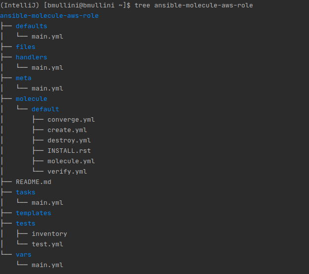

# Working with Ansible Molecule and AWS

Last updated: 08.07.2020

## Purpose

The purpose of this document is to provide a tutorial on how to
use AWS EC2 (VMs) instances to run Ansible Molecule tests.

## Prerequisites

Fedora 27 or newer.

An Amazon AWS account.

### Installation

#### Installing Python 3 on Fedora
1. Open up a terminal
1. sudo dnf install python3.8
1. Type `python3.8 --version`
1. The output should show you are running Python 3.8.0


#### Setup the AWS Environment

1. Open up a terminal
1. mkdir -p $HOME/.aws
1. cd $HOME/.aws
1. Make the file **.env**
1. Edit your **.env** file.  Enter the following
environment variables:

      ```yaml
       AWS_REGION="us-east-1 <this value should be different if you don't live close to the US east coast.>"
       AWS_ACCESS_KEY_ID="<your aws access key id: should be in your credentials.csv file>"
       AWS_SECRET_ACCESS_KEY="<your aws secret access key:  should be in your credentials.csv file>"
      ```
   
1. cd
1. Edit your **.bashrc** file.  Add the following line:  

    `source $HOME/.aws/.env`

1. Save your **.bashrc** file and close your terminal window.

Now your AWS account credentials can be accessed by your
Python virtual environment and Ansible Molecule.

### Setup your virtual environment

1. Open up a terminal
1. Navigate to a directory where you plan on putting your
python virtual environments.

    :warning: You must always work out of a virtual environment.
    Virtual environments prevent you from corrupting
    your default system virtual environment and allow users to install different
    software for each virtual environment.

1. Run `python3.8 -m venv venv_ansible_molecule_and_aws`
1. To activate your virtual environment on **Fedora**, you run
`source ./venv_ansible_molecule_and_aws/bin/activate`
1. Run `python --version`.  This is the version of Python running in your
virtual environment.
1. Run `pip install --upgrade pip`
1. Run `pip list`.  This should list the modules currently installed in your
environment.  Notice how ansible is not present.
1. Run `pip install ansible==2.9`.  The command installs **ansible 2.9** in the
virtual environment.
1. Run `pip list` to confirm **ansible 2.9** is installed.
1. Run `pip install molecule==3.0.4`
1. Run `pip list` to confirm **molecule 3.0.4** is installed.
1. Run `pip install molecule[docker]`

    The **molecule[docker]** provides the code to spin up
    docker containers for molecule tests.
  
1. Run `pip install boto boto3`

    The **boto and boto3** packages allow Ansible Molecule and Python
    to interact with your Amazon AWS environment.

### Instructions

1. Open up a terminal
1. `source ./venv_ansible_molecule_and_aws/bin/activate`
1.  Create an Ansible role with molecule by running the following:

    `molecule init role ansible-molecule-aws-role -d delegated`

1. Run `tree ansible-molecule-aws-role`

    The following should be your output:
    
    

    The **ansible molecule** role looks like a typical ansible role, except for 
    the **molecule** folder.  The explanation of the **molecule** folder is below:
    
    1. **default** directory = The name of the molecule scenario.  The molecule tests
    can be separated into different **scenarios** to test the role in different ways.
    Each Ansible Molecule role should have a **default** scenario to show the
    most likely way the role will be executed.
    
    1. **converge.yml** =  The Ansible code to execute for the test.  Defaults to use
    the role code in **tasks/main.yml**
    
    1. **INSTALL.rst** = The file lists the requirements to run the molecule tests.
    In this tutorial, the only requirement is to have **docker** running.
    
    1. **molecule.yml** = This file deserves some extra explanation.  The following is the contents
    of the file.
    
        ```yaml
            ---
            dependency:
              name: galaxy
            driver:
              name: delegated
            platforms:
              - name: instance
            provisioner:
              name: ansible
            verifier:
              name: ansible
        ``` 
   
       1. **dependency** = The dependent software needed to run the test.  Currently, we only need
       galaxy, but you can pass a **requirements.yml** to get additional roles and collections needed.
       
       1. **driver** = The driver used to spin up either a container or vm to 
       run the molecule tests.  In our case, we will be using the **delegated** driver.  
       The **delegated** driver provides the **hooks** necessary to run 
       ansible molecule with your unique vm or container environment.
       In our case, we will integrate AWS into ansible molecule using the **hooks**.
       
       1. **platform** = Given the driver, this tells molecule how to configure 
       the container or vm.  In our case, we will be spinning up an AWS EC2 instance as our vm.  We
       will change the **name** to coorespond with the **name** of the EC2 instance.
            
       1. **provisioner** = The **provisioner** manages the instance lifecycle.  Currently, the only provisioner
       is ansible.
       
       1. **verifier** = The **verifier** runs tests after running the ansible code.  Currently, we are using
       the **ansible** verifier.  The **ansible** verifier uses the **verify.yml** to test that the proper
       changes are made by the role.  If the changes have not occurred according to the **verify.yml**,
       the tests fail.
   
1.  We need to change our **molecule.yml** file to have the following contents:
   
         ```yaml
         ---
         dependency:
           name: galaxy
         driver:
           name: delegated
           ssh_connection_options:
               - '-o ControlPath=~/.ansible/cp/%r@%h-%p'
         platforms:
           - name: aws-ec2-instance
         provisioner:
           name: ansible
           log: true
           config_options:
             defaults:
               remote_user: centos
             privileged_escalation:
               become: true
               become_ask_pass: false
         verifier:
           name: ansible
         ```

      1. We added the **ssh_connection_options** to override the default
      way that Ansible Molecule connects via ssh.
      
      1. We changed the **name** of the vm to **aws-ec2-instance** to coorespond to
      the name of our EC2 instance.
      
      1. We added **log** equal to true to see more verbose output when
      we run Ansible Molecule on the role.
      
      1. We added config options to change the default generated **ansible.cfg**
      file.  Here is the description of the changes:
      
            1. **remote_user** = centos
            
                This is the user the EC2 instance expects.
                
            1. **become** = true
            
                This tells Ansible to allow the **centos** user
                to become root.
                
            1. **become_ask_pass** = false
            
               This tells ansible not to worry about asking for the
               **centos** user password when running **root** (
               privileged) commands.

1. **verify.yml**:  The ansible code to run after running the ansible role.
The code checks for proper changes, and if they haven't occurred, the molecule test fails.

    So we have to remember that we want to do **Test Driven Development** 
    when we create any new code or configuration.  In this case,
    we will be testing the configuration to ensure the AWS instance is running, 
    and we can gather facts.

1. Add the code by running through the **Red, Green, Refactor** iteration:
    1. Run the test representing the **Red** in the **Red, Green, Refactor** iteration:

        1. Run the role using `molecule converge`

            
    
            The test failed as expected.  We ran the **Red** in the **Red, Green, Refactor** 
            steps.  We were running the test without even configuring the AWS environment.  
            You **always** run a test with no code for a new role to ensure that the
            test fails properly.

        1. Run `molecule destroy`.  We don't want bad configuration around for 
        future tests.  We want to start from scratch each time. 

    1. Run the test representing the **Green** in the **Red, Green, Refactor** iteration:

        1. mkdir -p ./molecule/default/vars
        1. cd ./molecule/default/vars
        1. Create the **main.yml** file by adding the following variables.  Make
        sure you replace the **aws_ami** with the Amazon Centos AMI you plan
        on using.
        
              ```yaml
             aws_instance_name: "aws-ec2-instance"
             aws_key_pair: "my_keypair"
             role_path: "../.."
             aws_private_key: "{{ role_path }}/files/aws_private_key"
             create_private_key: true
             aws_default_image_size: 8
             aws_image_size: 20
             aws_ami: "ami-00594b9c138e6303d"
             
             aws_instances:
               - name: "{{ aws_instance_name }}"
                 public_ip: "10.10.10.55"
                 user: "centos"
                 port: 22
              ```           
  
        1. Remove all the contents of the **molecule/default/create.yml** file.
        1. Start the **create.yml** file by adding the following contents.
           
            ```yaml
            ---
            - name: Create
              hosts: localhost
              connection: local
              gather_facts: true
              no_log: "{{ molecule_no_log }}"
              tasks:
            
                - name: Include the variables needed for creation
                  include_vars:
                    file: "vars/main.yml"
           ```
 
        1. So far we have just added the variables to the **create.yml** file.
        1. Add the following contents to the end of the **create.yml** file.
        
           ```yaml
           - name: Set molecule directory
             set_fact:
               molecule_ephemeral_directory: '{{ lookup(''env'', ''MOLECULE_EPHEMERAL_DIRECTORY'') }}'
           ```
        
        1. The contents above creates the variable called **molecule_ephemeral_directory**.
        The variable holds the directory path where molecule creates all the necessary artifacts to run a molecule scenario.
        
        1. Add the following contents to the end of the **create.yml** file.
        
           ```yaml
             - name: Set the molecule directory private key
               set_fact:
                 aws_molecule_private_key_file: "{{ molecule_ephemeral_directory }}/private_key"
           ```
        
        1. The contents above creates the variable called **aws_molecule_private_key_file**.
        The variable holds the full file path to where we add the Amazon private key.
        
        1. Add the following contents to the end of the **create.yml** file.
     
           ```yaml
            - name: create a new ec2 key pair, returns generated private key
              ec2_key:
                name: "{{ aws_idm_key_pair }}"
                state: absent
              when: create_private_key == true
           ```   
      
        1. The contents above deletes the existing Amazon EC2 public/private key pair.
        We perform this task when we want to create a new key pair with the same name.
        We use the new key pair to ssh into the Amazon EC2 instance.
     
        1. Add the following contents to the end of the **create.yml** file.
          
           ```yaml
           - name: create a new ec2 key pair, returns generated private key
             ec2_key:
               name: "{{ aws_idm_key_pair }}"
               state: present
             register: key_pair_details
           ```   
           
        1. The contents above creates the Amazon EC2 public/private key pair.
        We use the key pair to ssh into the Amazon EC2 instance.
       
        1. Add the following contents to the end of the **create.yml** file.
          
            ```yaml
            - name: Set Key Pair Facts
              set_fact:
                aws_keypair: "{{ key_pair_details['key'] }}"
            ```   
           
        1. The contents above extracts the key pair information from the output
        of the previous task.  We will use the information to
        extract the private key and store the value in our private key file.

        1. Add the following contents to the end of the **create.yml** file.
          
             ```yaml
             - name: Copy the private key to a file so we can ssh into it
               copy:
                 content: "{{ aws_keypair['private_key'] }}"
                 dest: "{{ aws_private_key }}"
               when: create_private_key == true
             ```   
           
        1. The contents above stores the private key in the 
        **ansible-molecule-aws-role/files/aws_private_key** file.
        
        1. Add the following contents to the end of the **create.yml** file.
              
             ```yaml
              - name: Copy the private key to the molecule config directory
                copy:
                  src: "{{ aws_private_key }}"
                  dest: "{{ aws_molecule_private_key_file }}"
                  mode: 0600
             ```   
               
        1. The contents above copies the private key file to the ansible 
        molecule directory.  The ansible molecule directory does not
        exist until molecule executes and gets destroyed when the execution
        is complete.
              
        :construction:
 